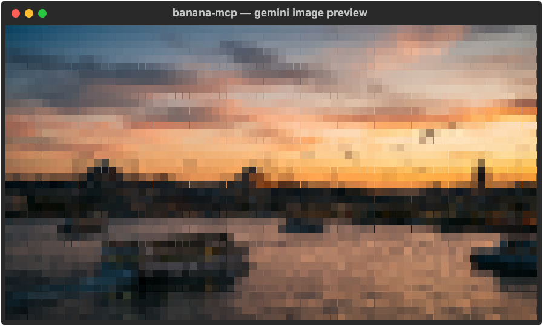

# 🍌 banana-mcp



An MCP server (+ standalone Python scripts) that generates images with your own
Google **Gemini** session — the "Nano Banana" image model — driven straight over
Gemini's web HTTP flow. **No browser, no headful Chrome: it's headless by
nature.** It even previews the result **right in your terminal** as ASCII/ANSI art.

You bring your **own** Google account cookies (exported with a browser
extension). The server signs requests as *you*, running your *own* prompts
against your *own* Gemini access.

---

## ⚠️ Personal use — read first

- This is a **bring-your-own-credentials** tool for **personal use**. It uses
  **your own** Google/Gemini session, which **you** supply locally. The project
  ships **no** tokens and stores nothing remotely.
- Automating a web product may be restricted by Google's Terms of Service. **You
  are solely responsible** for how you use it, for the prompts you run, and for
  the images you generate — including compliance with Google's policies and all
  **applicable laws** in your jurisdiction.
- Do **not** use it to impersonate real people, produce content depicting
  minors, or generate anything illegal. All example prompts are of **fictional
  adults** or neutral scenes.
- Your cookies are a **live login**. Never commit `secrets/`, storage dumps, or
  HAR files. The repo's `.gitignore` blocks them by default — keep it that way.

---

## How it works

Gemini's web UI generates images via an HTTP RPC endpoint
(`.../BardFrontendService/StreamGenerate`) — **not** a WebSocket. `banana-mcp`
replays that flow with your session cookies:

1. Auth = your Google cookies (`__Secure-1PSID`, optionally `__Secure-1PSIDTS`,
   plus the standard `SID`/`SAPISID`/… set), captured once with a browser
   extension.
2. The prompt (plain text *or* a structured JSON "Nano Banana" object) is sent
   as the message body, with an image-capable model header.
3. The response returns the generated image URL(s); the tool downloads them to
   `output/` and can render a terminal preview.

Under the hood it uses the excellent
[`gemini_webapi`](https://github.com/HanaokaYuzu/Gemini-API) library, which
handles the XSRF (`SNlM0e`) token and `__Secure-1PSIDTS` rotation.

---

## Install

Pick one. All three read your cookies from the same place
(`~/.config/banana-mcp/cookies.json` — see **Cookies** below).

### A) As a Claude Code plugin (easiest)

```
/plugin marketplace add nsozturk/banana-mcp
/plugin install banana-mcp@banana-mcp
```

Requires [`uv`](https://docs.astral.sh/uv/) on your PATH (the plugin launches the
server with `uvx`). Install it once:
`curl -LsSf https://astral.sh/uv/install.sh | sh` (macOS/Linux) or
`irm https://astral.sh/uv/install.ps1 | iex` (Windows).

### B) With uvx / pip (no clone)

```bash
# run the MCP server directly (no install)
uvx --from git+https://github.com/nsozturk/banana-mcp banana-mcp

# or install the console scripts
pip install git+https://github.com/nsozturk/banana-mcp
```

This exposes two commands: **`banana-mcp`** (the MCP server) and
**`banana-generate`** (the CLI batch generator).

### C) From a clone (for development)

```bash
git clone https://github.com/nsozturk/banana-mcp && cd banana-mcp
python3.11 -m venv .venv
.venv/bin/python -m pip install -e .    # or: -r requirements.txt
```

> **Python 3.11+** required (the upstream library needs `enum.StrEnum`).

---

## Cookies (bring your own)

1. Sign in to <https://gemini.google.com> in Chrome with the account you want to
   use, and confirm you can generate an image there.
2. Install the **StorageDump** Chrome extension:
   <https://chromewebstore.google.com/detail/storagedump/kihoghfekemdccfnpjefmggehpgnjnab>
3. On the Gemini tab, export the site's storage with StorageDump. It saves a
   `storagedump_gemini.google.com_<timestamp>/` folder containing `cookies.json`.
4. Extract just the cookies this tool needs (values are never printed):

```bash
python scripts/extract_cookies.py path/to/storagedump_gemini.google.com_<timestamp>
# writes ~/.config/banana-mcp/cookies.json (chmod 600). Use --out to override.
```

You can also point at any cookie file with the `BANANA_COOKIES` env var.

> **Cookies rotate and go stale.** If generations start returning "signed out",
> re-export a **fresh** StorageDump and re-run `extract_cookies.py`.

---

## Connect as an MCP server

`banana-mcp` speaks MCP over stdio and exposes **five** tools:

| Tool | What it does |
|---|---|
| `banana_account_status` | Check the session is authenticated / image-capable |
| `banana_generate_image` | Generate from a free-form prompt string (+ ASCII preview) |
| `banana_generate_from_file` | Batch-generate from a `*-image-prompts.json` file |
| `banana_list_prompts` | List prompt ids/titles inside a prompt JSON file |
| `banana_preview_image` | Render any existing image as terminal ASCII/ANSI art |

### Register with Claude Code

The **plugin** (Install → A) wires this up automatically. To register manually:

```bash
# uvx (git) — no clone needed:
claude mcp add banana --scope user -- \
  uvx --from git+https://github.com/nsozturk/banana-mcp banana-mcp

# or a local clone:
claude mcp add banana --scope user -- \
  /abs/path/banana-mcp/.venv/bin/python /abs/path/banana-mcp/mcp_server.py
```

Or edit `~/.claude.json` / a project `.mcp.json`:

```json
{
  "mcpServers": {
    "banana": {
      "command": "uvx",
      "args": ["--from", "git+https://github.com/nsozturk/banana-mcp", "banana-mcp"]
    }
  }
}
```

The same shape works for Claude Desktop (`claude_desktop_config.json`) and other
MCP hosts. Restart the client, then ask it to run `banana_account_status` or
generate an image.

---

## Terminal preview

Every generated (or existing) image can be shown **in your terminal**:

- **Engine = hybrid.** If [`chafa`](https://github.com/hpjansson/chafa) — the most
  capable terminal image viewer — is installed, it's used for the best fidelity
  (truecolor / sixel). Otherwise a **pure-Python** Pillow renderer draws it with
  24-bit `▄` half-blocks. Either way it works with zero system setup.
- **Auto-install.** The Python preview deps (Pillow; plus `rich`/`cairosvg` for
  PNG export) are installed automatically on first use, using **`uv pip`** when
  `uv` is present, otherwise **`pip`** — so it works in both kinds of environment.
- The CLI prints a colored preview after each image; MCP tools return a plain
  ASCII preview (renders safely in any transcript). Optional `chafa` for max
  quality: `brew install chafa` / `apt install chafa`.

The README hero above is a terminal preview rendered to PNG by
`scripts/make_hero.py`.

---

## Usage — CLI

```bash
# First 3 prompts of a file -> output/<file-stem>/ (with colored previews)
banana-generate examples/example-image-prompts.json --limit 3

# Specific ids / by index / custom output / no preview
banana-generate examples/example-image-prompts.json --ids example_001_bosphorus_sunrise
banana-generate examples/example-image-prompts.json --index 0 1 2 --out output/run1 --no-preview
```

(From a clone without installing, `python scripts/generate.py …` works too.)
Each run writes the images plus a `results.json` manifest into the output dir.

### Prompt file format

```json
{
  "prompt_set": { "title": "...", "global_constraints": ["..."] },
  "prompts": [
    { "id": "unique_id", "scene": { "...": "any nested JSON is serialized as the prompt" } }
  ]
}
```

The whole prompt object is serialized to text and sent to Gemini. See
[`examples/example-image-prompts.json`](examples/example-image-prompts.json).

---

## Project layout

```
banana-mcp/
├── mcp_server.py            # thin entry shim -> banana.server
├── banana/
│   ├── server.py            # MCP server (5 tools)  [console script: banana-mcp]
│   ├── cli.py               # CLI batch generator   [console script: banana-generate]
│   ├── config.py            # cookie/output path resolution
│   ├── client.py            # authenticated GeminiClient singleton
│   ├── prompts.py           # load/serialize structured prompt files
│   ├── generator.py         # generate + download images
│   ├── preview.py           # terminal preview (chafa / Pillow half-block) + PNG export
│   └── _bootstrap.py        # pip/uv auto-installer for preview deps
├── scripts/
│   ├── extract_cookies.py   # StorageDump export -> cookies.json
│   ├── generate.py          # shim -> banana.cli
│   └── make_hero.py         # build assets/hero.png
├── .claude-plugin/          # plugin.json + .mcp.json + marketplace.json
├── examples/                # neutral sample prompt file
├── assets/hero.png          # README hero (committed)
├── secrets/                 # dev cookie location (gitignored — never commit)
└── output/                  # generated images (gitignored)
```

---

## Troubleshooting

- **"signed out" / no image returned** → cookies are stale. Re-export a fresh
  StorageDump and re-run `scripts/extract_cookies.py`.
- **`ImportError: cannot import name 'StrEnum'`** → you're on Python < 3.11.
- **Plugin server won't start** → make sure `uv` is installed and on PATH.
- **Rate limited** → space out large batches; you're using a normal account.

---

## Future

Publishing to PyPI would shorten the commands to
`uvx --from banana-mcp banana-mcp` / `pip install banana-mcp`. Until then, the
`git+https://…` forms above work identically.

## License

MIT — see [LICENSE](LICENSE). This project is not affiliated with, endorsed by,
or connected to Google. "Gemini" is a trademark of Google LLC.
